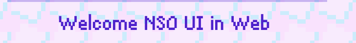

---
### Yes it's a project for porting UI from **Needy Streamer Overload** in web (for now it's on alpha)

Plans:
- [X] Windows
- [X] Buttons
- [X] Inputs 
- [ ] Customization
- [ ] JINE UI


How to add? 
In your file add this code:
```html
<link rel="stylesheet" href="https://raw.githubusercontent.com/ArThirtyFour/NeedyWebUI/refs/heads/main/nso_ui.css">
```
Because for now it's a alpha version example on html file in this repository