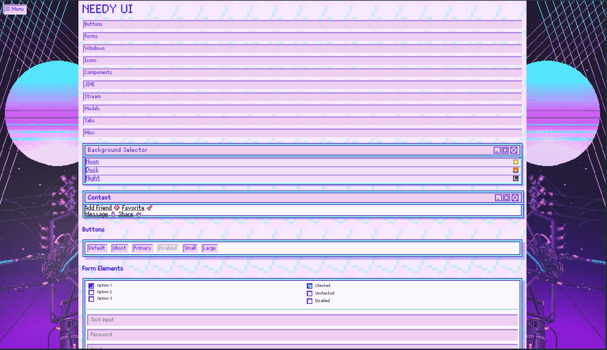

### Yes it's a project for porting UI from **Needy Streamer Overload** in web (for now it's on beta) and add some new feauters

Ported from game:
- Windows
- Buttons
- Inputs 
- Icons 
- JINE UI
- Task Manager
- Streams Windows
- Poketer posts/comments
- Background Selector (day/dusk/night)

Added by us:
- Sidebar navigation
- Toggle switches
- Customization
- Dropdown menus
- Accordion / collapsible sections
- Tabs
- Toast notifications
- Tooltips
- Modal / Dialog
- Badges
- KPI Cards
- Progress Bars (custom animated with canvas)
- Music player
- Loading States (spinners)
- Tables

## Quick Start

Add to your HTML `<head>`:

```html
<link rel="stylesheet" href="https://cdn.jsdelivr.net/gh/ArThirtyFour/NeedyWebUI@main/nso_ui.css">
```

---

## Showcase & Live Examples

- **Full Component Showcase:** `examples/index.html` — live demo of all UI compon
- **[Etoneya Project](https://internet-tenshi.kangel.tech)** - Full wedsite realizaton of NSO UI


---

Big thanks [Needy Streamer Overload Skin by lezzthanthree/AR34 (me)](https://github.com/ArThirtyFour/Russian-Needy-Streamer-Overload) for the desktop UI assets and visual guidelines 
